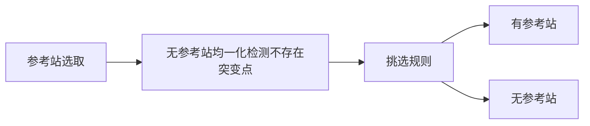
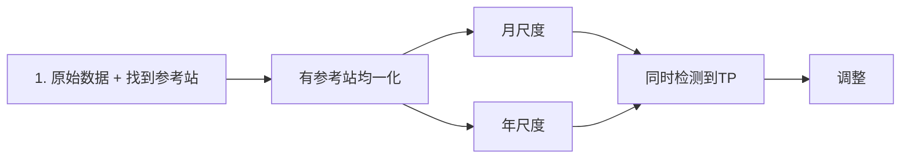
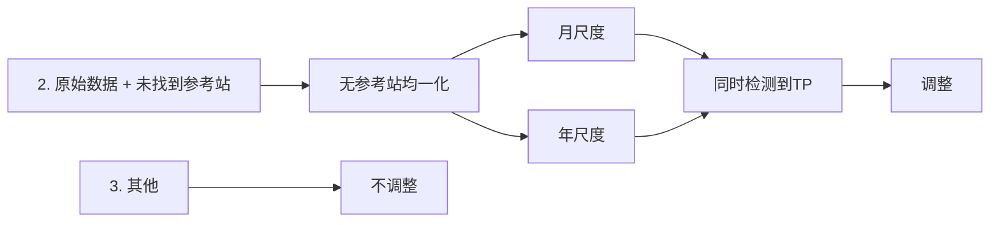

```mermaid
flowchart LR
参考站选取 --> 无参考站均一化检测不存在突变点 --> 挑选规则 --> 有参考站 & 无参考站
```

```mermaid
flowchart LR
data[1. 原始数据 + 找到参考站] --> 有参考站均一化 --> 月尺度 & 年尺度 --> 同时检测到TP --> 调整
```

```mermaid
flowchart LR
data2[2. 原始数据 + 未找到参考站] --> 无参考站均一化 --> 月尺度 & 年尺度 --> 同时检测到TP --> 调整
other[3. 其他] --> 不调整
```

